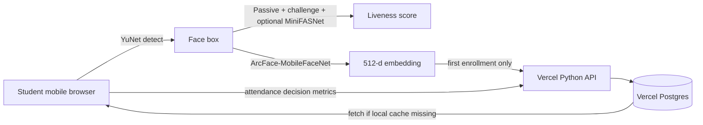

# FaceRoll Phase V2 Plan

## Architecture

## Server responsibility

The server does **not** process face images in Phase V2. It only:

- stores the enrollment embedding,
- returns the embedding when the local device cache is empty,
- saves attendance records,
- enforces thresholds for spoof score and similarity.

## Client responsibility

The phone handles:

- camera access,
- YuNet face detection,
- liveness challenge,
- ArcFace-MobileFaceNet embedding extraction,
- cosine similarity verification,
- IndexedDB embedding cache.
